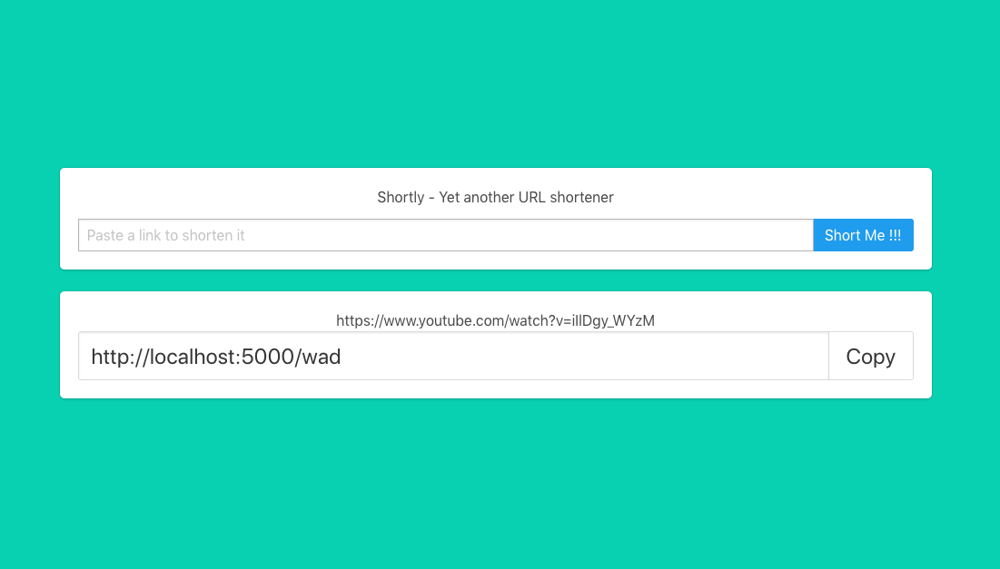

# Shortly

Yet another URL shortener.
Built using Flask (application factory structure) and VueJS client.
SQLite is used as database storage.
Uses Python 3.6.

#  Concepts

The shorten url is a "word".
From the file "/fixtures/wordlist.txt" a model WordList is populated.
Based on the url path (example: https://hostname/path), the path letter are processed to a list with unique letters like : ['p', 'a', 't', 'h'].
For each letter the first available word exists in WordList when the word is used, for example if not any word is available with 'p' the next search is with 'a'.
If all word are taken when a 8 bit hash is generated.

# Installation

**Note**: For installation `pipenv` is used. An enviromental varialble handles mode for example `export SHORTLY_MODE='prod'` creates a instance based on 'settings/production.py'.
**The default mode is 'dev'**

1. Clone this repo
2. pipenv --three (create a python3 env)
3. pipenv install --dev (install with dev libs)
4. pipenv shell
5. python manage.py tests (run tests)
6. python manage.py shortly-init (polulate initial dataabase)
7. python manage.py --debug run (run mode with dedug on)

more management command can be viewed: `python manage.py --help`

# TODO

1. Bundle static files using Flask-Assets
